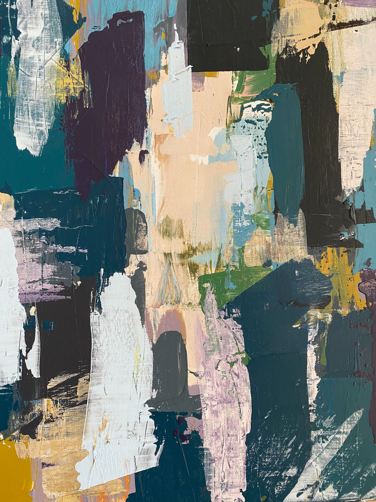

# Painting with Neural Style Transfer as aid
___

Generate a painting-like image using a neural style transfer model to transform the input image into a brush painting style.

### Objective

Given an input image, perform neural style transfer to transform it into a brush stroke painting. The generated image is then analyzed by breaking down its colors to display a visual palette. Finally, a first suggestion for the painting is provided using color segmentation to create a series of images

### Style image

The style image used for the transformation is the next:

### Model

The VGG19 network, which is widely used in style transfer algorithms, is employed as the model in this case. This pre-trained network is utilized to extract the content and style representations from the input images. The extracted features are then employed to generate a new image that merges the content of one image with the style of another image."

### Visualitation

A streamlit app has been developed for the process. The user inputs an image and the program returns the transformed image, a color palette, and a series of images showing the painting process.

